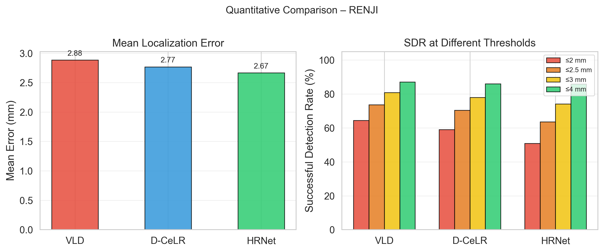
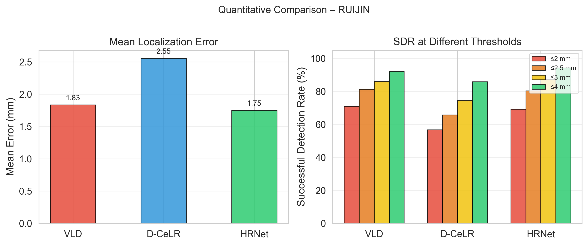

<div align="center">

# 🔬 Cervical Spine Landmark Detection

**基于多范式融合的颈椎脊柱X线片关键点检测算法研究**

*Multi-paradigm Fusion for Cervical Spine X-ray Landmark Detection*

[](https://www.python.org/)
[](https://pytorch.org/)
[](LICENSE)

</div>

<p align="center">
  
  
</p>

<div align="center">

| Dataset | Hospital | Samples | Landmarks | Best Single | Best Ensemble |
|:-------:|:--------:|:-------:|:---------:|:-----------:|:-------------:|
| **RENJI** | 仁济医院 | 30 | 56 | **2.66 mm** | **2.36 mm** ↓25% |
| **RUIJIN** | 瑞金医院 | 14 | 52 | **1.75 mm** | **1.56 mm** ↓15% |

</div>

---

## ✨ Highlights

- 🏥 **真实临床数据**：覆盖两家医院、两种分辨率（0.125 / 0.28 mm/px）
- 🔬 **三范式系统对比**：CenterNet (VLD) / HRNet / Transformer (D-CeLR) 首次在颈椎脊柱任务上横向评测
- 🚀 **四项有效优化**：迁移学习 ↓34% | TTA ↓26% | ImageNet预训练 ↓21~26% | Ensemble融合 ↓15~25%
- 📊 **统一评估体系**：Hungarian Matching + resolution-aware mm误差，跨医院、跨方法公平对比
- 🎨 **可视化图表**：Error Distribution / CDF / Bland-Altman / Worst Samples 完整分析

---

## 🏗️ Methods

| Method | Paradigm | Input Size | RENJI (mm) | RUIJIN (mm) | Key Technique |
|:------:|:--------:|:----------:|:----------:|:-----------:|:-------------:|
| VLD | Heatmap Regression | 1024×512 | 2.88 | 1.83 | Horizontal-flip TTA |
| D-CeLR | CNN + Transformer | 1024×1024 | 2.82 | 2.57 | Transfer Learning + Aug |
| HRNet | High-Resolution Net | 256×256 | **2.66** | **1.75** | ImageNet Pretraining |
| **Ensemble** | Weighted Fusion | — | **2.36** | **1.56** | Hungarian + Grid Search |

---

## 🛠️ Tech Stack

<p align="center">
  
  
  
  
  
</p>

**Frameworks**: PyTorch | OpenCV | NumPy | SciPy | Matplotlib | Seaborn

---

## 📁 Repository Structure

```
├── Vertebra-Landmark-Detection/    # VLD (CenterNet-based)
├── D-CeLR/                         # D-CeLR (ResNet34 + Transformer)
├── HRNet-Facial-Landmark-Detection/ # HRNet-W18 for spine
├── outputs/
│   ├── best_results/               # 🏆 Best result visualizations
│   │   ├── RENJI/
│   │   │   ├── single_best_HRNet_pretrained/
│   │   │   ├── ensemble_best/
│   │   │   └── figures/
│   │   └── RUIJIN/
│   ├── comparison_table_all.md     # 📊 Full quantitative report
│   └── paper_figures/              # 📈 Publication-quality figures
├── ensemble_optimize.py            # Ensemble grid search
├── ensemble_spine.py               # Core evaluation utilities
├── generate_paper_figures.py       # Figure generation script
├── generate_ensemble_visualization.py
├── convert_renji_to_vld_dataset.py # Data conversion
├── convert_ruijin_to_vld_dataset.py
├── midterm_report_keypoint_detection.md
├── 实习记录.md
└── README.md                       # 📄 This file
```

---

## 🚀 Quick Start

### 1. Environment Setup

```bash
pip install torch torchvision opencv-python numpy scipy matplotlib seaborn yacs tensorboardX
```

### 2. Data Preparation

Convert raw NIfTI annotations to unified formats:

```bash
python convert_renji_to_vld_dataset.py --src_root data/RENJI --out_root Vertebra-Landmark-Detection/data_renji_vld --expected_points 56

python convert_ruijin_to_vld_dataset.py --src_root data/RUIJIN --out_root Vertebra-Landmark-Detection/data_ruijin_vld --expected_points 52
```

### 3. Training

**VLD (RENJI)**
```bash
cd Vertebra-Landmark-Detection
python main.py --phase train --dataset renji --data_dir data_renji_vld --num_epoch 60 --max_points 56
```

**HRNet (RENJI)**
```bash
cd HRNet-Facial-Landmark-Detection
python tools/train.py --cfg experiments/renji/spine_renji_hrnet_w18.yaml
```

**D-CeLR (RENJI)**
```bash
cd D-CeLR
# Follow D-CeLR README for training commands
```

### 4. Evaluation

```bash
# VLD with TTA
python Vertebra-Landmark-Detection/main.py --phase eval --dataset renji --resume model_60.pth --tta

# HRNet
python HRNet-Facial-Landmark-Detection/tools/eval_spine.py --cfg experiments/renji/spine_renji_hrnet_w18.yaml --model-file checkpoints/model_best.pth --resolution-csv D-CeLR/data/renji_npy_direct/test_resolution.csv
```

### 5. Ensemble Optimization

```bash
python ensemble_optimize.py --dataset renji
python ensemble_optimize.py --dataset ruijin
```

### 6. Visualization

```bash
# Paper figures
python generate_paper_figures.py

# Ensemble visualization
python generate_ensemble_visualization.py

# HRNet sample visualization
python HRNet-Facial-Landmark-Detection/tools/visualize_spine.py --cfg experiments/renji/spine_renji_hrnet_w18.yaml --prediction-file outputs/inference_renji_spine_renji_hrnet_w18_pretrained_e60/predictions/predictions.pth --output-dir outputs/best_results/RENJI/single_best_HRNet_pretrained
```

---

## 📊 Key Results

### RENJI (仁济医院, 30 cases, 56 landmarks, ~0.125 mm/px)

| Stage | Method | Mean (mm) | Acc@2 | Acc@2.5 | Acc@3 | Acc@4 |
|:-----:|:------:|:---------:|:-----:|:-------:|:-----:|:-----:|
| Baseline | VLD | 3.90 | 0.640 | 0.734 | 0.805 | 0.869 |
| Baseline | D-CeLR | 3.16 | 0.564 | 0.662 | 0.733 | 0.828 |
| Baseline | HRNet | 3.37 | 0.327 | 0.441 | 0.548 | 0.722 |
| **Optimized** | VLD + TTA | **2.88** | **0.645** | 0.737 | 0.809 | 0.870 |
| **Optimized** | D-CeLR + Aug | **2.82** | 0.574 | 0.693 | 0.768 | 0.848 |
| **Optimized** | HRNet + Pretrain | **2.66** | 0.503 | 0.630 | 0.735 | 0.854 |
| **🏆 Best** | Ensemble (0.4/0.3/0.3) | **2.36** | **0.688** | **0.747** | **0.817** | **0.891** |

### RUIJIN (瑞金医院, 14 cases, 52 landmarks, 0.28 mm/px)

| Stage | Method | Mean (mm) | Acc@2 | Acc@2.5 | Acc@3 | Acc@4 |
|:-----:|:------:|:---------:|:-----:|:-------:|:-----:|:-----:|
| Baseline | VLD | 1.83 | 0.710 | 0.813 | 0.860 | 0.922 |
| Baseline | D-CeLR | 3.90 | 0.293 | 0.378 | 0.486 | 0.662 |
| Baseline | HRNet | 2.37 | 0.466 | 0.615 | 0.727 | 0.890 |
| **Optimized** | VLD e100 | **1.70** | **0.729** | 0.823 | 0.887 | 0.937 |
| **Optimized** | D-CeLR + Transfer | **2.57** | 0.560 | 0.650 | 0.742 | 0.854 |
| **Optimized** | HRNet + Pretrain | **1.75** | 0.692 | 0.804 | 0.872 | 0.942 |
| **🏆 Best** | Ensemble (0.5/0.5) | **1.56** | **0.769** | **0.841** | **0.893** | **0.938** |

---

## 🔑 Key Findings

1. **TTA收益与分辨率强相关**：horizontal-flip TTA在高分辨率RENJI上效果显著（↓26%），但在低分辨率RUIJIN上无效，提示TTA策略需结合数据特性设计

2. **ImageNet预训练对医学脊柱任务具有强迁移能力**：HRNet采用ImageNet初始化后，两家医院数据mean error均降低>20%，acc@2提升>50%

3. **三方法存在显著互补性**：VLD精度高但偶有离群值，D-CeLR稳定但mean偏高，HRNet预训练后性能均衡，为Ensemble提供理论基础

4. **迁移学习解决小样本过拟合**：D-CeLR在仅14例的RUIJIN数据上通过RENJI预训练+数据增强，mean error从3.90mm降至2.57mm

---

## 📄 Documents


[`outputs/comparison_table_all.md`](outputs/comparison_table_all.md) 

---

## 📜 License

This project is for academic research purposes. Please refer to individual submodules for their respective licenses.

---

<div align="center">

**Made with ❤️ for better spinal care.**

</div>
