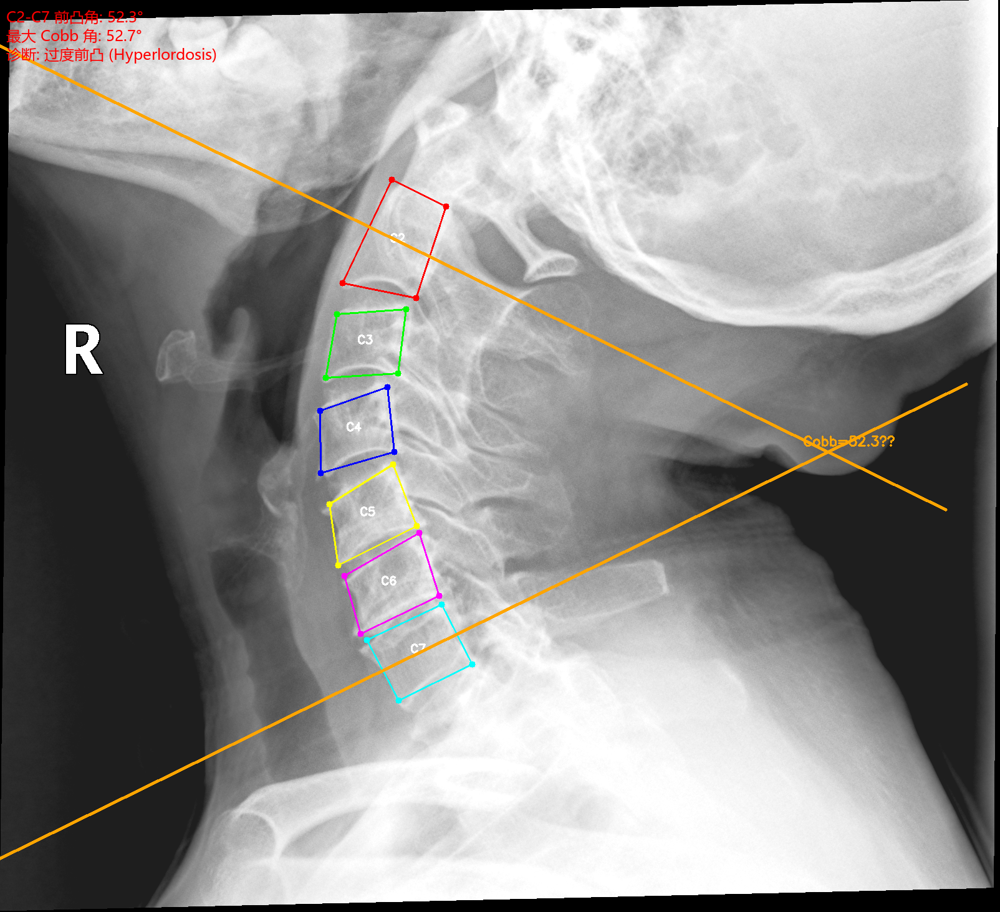
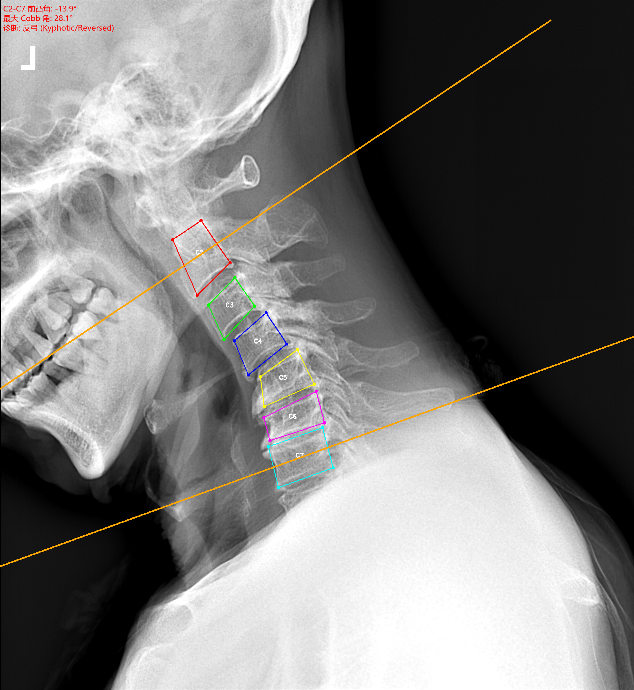
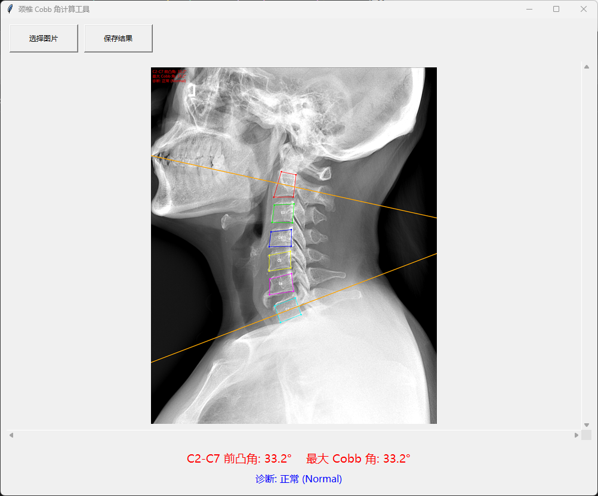

<div align="center">

# 颈椎脊柱 X 线片关键点检测与 Cobb 角自动测量

**本项目的最终成果是一个可直接运行的桌面应用 `cobb_app/`，基于多范式融合模型实现颈椎侧位 X 光片的椎体关键点自动检测与 Cobb 角测量。**

[](https://www.python.org/)
[](https://pytorch.org/)
[](LICENSE)

</div>

---

## 桌面应用 cobb_app

基于 HRNet + VLD 融合模型封装的单文件桌面测量工具，无需命令行即可快速完成 Cobb 角自动测量。

### 功能

- **一键加载**：选择 PNG/JPG 颈椎侧位片即可自动分析
- **智能方向统一**：自动识别椎体朝向，统一为椎体在左、棘突在右的标准视角
- **终板级 Cobb 角**：C2 取上终板、C7 取下终板，结果带正负号（正值 = 前凸，负值 = 反弓）
- **自动诊断**：正常 / 变直 / 过度前凸 / 反弓
- **可视化与导出**：C2-C7 椎体框 + 终板参考线 + 结果保存

### 快速运行

```bash
cd cobb_app
pip install -r requirements.txt
python main.py
```

### 示例结果

| 正常 (Normal) | 过度前凸 (Hyperlordosis) | 变直 (Straightened) | 反弓 (Reversed/Kyphotic) |
|:---:|:---:|:---:|:---:|
|  |  |  |  |
| C2-C7: **+33.4°** | C2-C7: **+52.3°** | C2-C7: **+17.6°** | C2-C7: **−13.9°** |

<p align="center">
  
  <br>
  <em>桌面应用主界面</em>
</p>

### 应用精度（椎体角点）

| 指标 | 数值 |
|:------:|:-----:|
| Mean Error | **1.78 mm** |
| Acc @ 2 mm | **73.3%** |
| Acc @ 3 mm | **86.2%** |
| Acc @ 4 mm | **90.9%** |

> 评估基于 RENJI test 集（29 例），仅统计 front 28 个椎体角点。

---

## 技术背景：模型复现与优化过程

桌面应用 `cobb_app` 的背后，是我们对三种主流关键点检测范式的系统复现、优化与融合。以下内容记录了为开发上述应用所进行的前期实验工作，包括模型对比、训练策略调优与融合权重搜索。

### 三范式对比

| 方法 | 范式 | 输入尺寸 | RENJI (mm) | RUIJIN (mm) | 关键技术 |
|:------:|:--------:|:----------:|:----------:|:-----------:|:-------------:|
| VLD | Heatmap Regression | 1024×512 | 2.88 | 1.83 | Horizontal-flip TTA |
| D-CeLR | CNN + Transformer | 1024×1024 | 2.82 | 2.57 | Transfer Learning + Aug |
| HRNet | High-Resolution Net | 256×256 | **2.66** | **1.75** | ImageNet Pretraining |
| **融合** | Weighted Fusion | — | **2.36** | **1.56** | Hungarian + Grid Search |

### 核心优化手段

- **迁移学习**：D-CeLR 跨域预训练，mean error 降低 34%
- **TTA**：horizontal-flip 测试时增强，高分辨率数据上效果显著（降低 26%）
- **ImageNet 预训练**：HRNet 采用 ImageNet 初始化后，两家医院 mean error 均降低 >20%
- **融合策略**：三方法互补，Ensemble 在 RENJI 上达到 2.36 mm

---

## 仓库结构

```
├── cobb_app/                       # 桌面应用（最终成果）
├── Vertebra-Landmark-Detection/    # VLD (CenterNet-based) 复现与训练
├── D-CeLR/                         # D-CeLR (ResNet34 + Transformer) 复现与训练
├── HRNet-Facial-Landmark-Detection/ # HRNet-W18 复现与训练
├── outputs/                        # 实验结果与可视化
├── evaluate_keypoints.py           # 关键点精度评估脚本（外部用）
├── ensemble_optimize.py            # 融合权重网格搜索
├── ensemble_spine.py               # 核心评估工具
├── generate_paper_figures.py       # 图表生成
├── convert_renji_to_vld_dataset.py # 数据格式转换
├── convert_ruijin_to_vld_dataset.py
└── README.md
```

---

## 训练与评估（复现细节）

### 环境配置

```bash
pip install torch torchvision opencv-python numpy scipy matplotlib seaborn yacs tensorboardX
```

### 数据准备

```bash
python convert_renji_to_vld_dataset.py --src_root data/RENJI --out_root Vertebra-Landmark-Detection/data_renji_vld --expected_points 56
python convert_ruijin_to_vld_dataset.py --src_root data/RUIJIN --out_root Vertebra-Landmark-Detection/data_ruijin_vld --expected_points 52
```

### 训练

```bash
# VLD
cd Vertebra-Landmark-Detection
python main.py --phase train --dataset renji --data_dir data_renji_vld --num_epoch 60 --max_points 56

# HRNet
cd HRNet-Facial-Landmark-Detection
python tools/train.py --cfg experiments/renji/spine_renji_hrnet_w18.yaml

# D-CeLR
cd D-CeLR
# 详见 D-CeLR README
```

### 评估

```bash
# VLD 带 TTA
python Vertebra-Landmark-Detection/main.py --phase eval --dataset renji --resume model_60.pth --tta

# HRNet
python HRNet-Facial-Landmark-Detection/tools/eval_spine.py --cfg experiments/renji/spine_renji_hrnet_w18.yaml --model-file checkpoints/model_best.pth --resolution-csv D-CeLR/data/renji_npy_direct/test_resolution.csv

# 融合优化
python ensemble_optimize.py --dataset renji
python ensemble_optimize.py --dataset ruijin
```

---

## 关键结果

### RENJI (仁济医院, 30 例, 56 个关键点, ~0.125 mm/px)

| 阶段 | 方法 | Mean (mm) | Acc@2 | Acc@2.5 | Acc@3 | Acc@4 |
|:-----:|:------:|:---------:|:-----:|:-------:|:-----:|:-----:|
| Baseline | VLD | 3.90 | 0.640 | 0.734 | 0.805 | 0.869 |
| Baseline | D-CeLR | 3.16 | 0.564 | 0.662 | 0.733 | 0.828 |
| Baseline | HRNet | 3.37 | 0.327 | 0.441 | 0.548 | 0.722 |
| 优化后 | VLD + TTA | **2.88** | **0.645** | 0.737 | 0.809 | 0.870 |
| 优化后 | D-CeLR + Aug | **2.82** | 0.574 | 0.693 | 0.768 | 0.848 |
| 优化后 | HRNet + Pretrain | **2.66** | 0.503 | 0.630 | 0.735 | 0.854 |
| **最优** | 融合 (0.4/0.3/0.3) | **2.36** | **0.688** | **0.747** | **0.817** | **0.891** |

### RUIJIN (瑞金医院, 14 例, 52 个关键点, 0.28 mm/px)

| 阶段 | 方法 | Mean (mm) | Acc@2 | Acc@2.5 | Acc@3 | Acc@4 |
|:-----:|:------:|:---------:|:-----:|:-------:|:-----:|:-----:|
| Baseline | VLD | 1.83 | 0.710 | 0.813 | 0.860 | 0.922 |
| Baseline | D-CeLR | 3.90 | 0.293 | 0.378 | 0.486 | 0.662 |
| Baseline | HRNet | 2.37 | 0.466 | 0.615 | 0.727 | 0.890 |
| 优化后 | VLD e100 | **1.70** | **0.729** | 0.823 | 0.887 | 0.937 |
| 优化后 | D-CeLR + Transfer | **2.57** | 0.560 | 0.650 | 0.742 | 0.854 |
| 优化后 | HRNet + Pretrain | **1.75** | 0.692 | 0.804 | 0.872 | 0.942 |
| **最优** | 融合 (0.5/0.5) | **1.56** | **0.769** | **0.841** | **0.893** | **0.938** |

---

## 文档

[完整量化对比报告](outputs/comparison_table_all.md)

---

## 开源协议

本项目仅供学术研究使用。各子模块的协议请参考其对应许可证。

---

<div align="center">

Cervical Spine Landmark Detection & Cobb Angle Measurement

</div>
