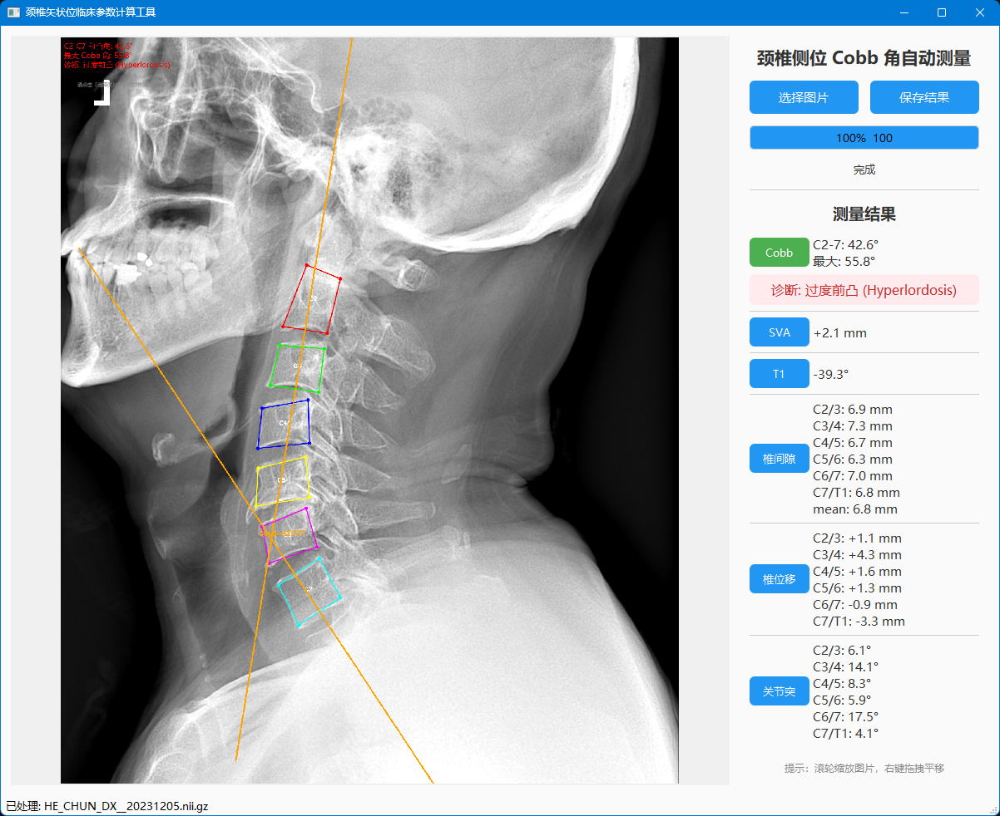

# 颈椎测量工具

基于 **拆分 VLD 模型**（椎体 + 关节突双模型）的颈椎侧位 X 光片关键点检测与 Cobb 角自动测量桌面应用。



---

## 功能特点

- **一键加载**：选择单张 PNG/JPG 格式的颈椎侧位 X 光片即可自动分析
- **HRNet + VLD 融合**：HRNet-W18（56 点全局回归）+ SpineNet（角点检测）融合，兼顾精度与鲁棒性
- **多参数测量**：Cobb 角、SVA、T1 斜率、椎间隙、椎位移、关节突角
- **智能方向统一**：自动识别椎体朝向，统一为椎体在左、棘突在右的标准侧位视角
- **终板级 Cobb 角计算**：
  - C2 取**上终板**，C7 取**下终板**
  - 中间椎体按上下位关系自动匹配终板
  - 结果带**正负号**：正值 = 前凸，负值 = 反弓
- **自动诊断**：正常 / 变直 / 过度前凸 / 反弓
- **可视化标注**：C2-C7 椎体框 + 终板参考线 + 交点角度标注
- **结果保存**：导出带标注的 PNG 图片

---

---

## 输入图片要求

为获得最佳测量效果，请尽量满足以下条件：

- **体位**：标准颈椎侧位片（Left Lateral 或 Right Lateral 均可）
- **范围**：C2 至 C7 椎体需完整、清晰可见
- **质量**：分辨率建议不低于 1000×1000，对比度适中，无明显运动伪影或截断
- **格式**：PNG 或 JPG

> 注意：过度旋转、严重曝光不足、或椎体被截断的片子可能导致检测失败或误差增大。

---

## 快速开始

### 环境要求

- Python 3.9+
- PyTorch ≥ 1.9（支持 CPU 或 CUDA）

### 安装依赖

```bash
pip install -r requirements.txt
```

### 运行

```bash
python main.py
```

---

## 文件结构

```
cervical_app/
├── main.py                  # 入口程序
├── requirements.txt         # Python 依赖
├── checkpoints/
│   ├── vertebrae.pth        # 椎体 28 点模型权重
│   └── facets.pth           # 关节突 28 点模型权重
├── src/
│   ├── inference.py         # 拆分 VLD 双模型推理
│   ├── clinical_parameters/ # 临床参数计算（Cobb/SVA/T1/椎间隙/位移/关节突）
│   └── gui.py               # PyQt5 图形界面
└── image/                   # 应用截图
```

---

## 模型信息

| 指标 | 数值 |
|------|------|
| 主干网络 | HRNet-W18 |
| 辅助网络 | SpineNet (VLD) 拆分双模型 |
| 训练数据 | 仁济医院颈椎侧位片 |
| 输出关键点 | 56 个角点（椎体 28 + 关节突 28），融合后提取 front/back 各 28 点 |
| **Mean Error** | **1.78 mm** |
| **Acc @ 2 mm** | **73.3%** |
| **Acc @ 3 mm** | **86.2%** |
| **Acc @ 4 mm** | **90.9%** |

> 评估基于 RENJI test 集（29 例），仅统计 front 28 个椎体角点。

---

## 打包为可执行文件

使用 PyInstaller：

```bash
pip install pyinstaller
pyinstaller --onefile \
  --add-data "models;models" \
  --add-data "config;config" \
  --add-data "hrnet_lib;hrnet_lib" \
  --add-data "src;src" \
  main.py
```

---

## 免责声明

本工具仅供科研和教学参考，**不可替代专业医师的诊断**。临床决策请以放射科医生的正式报告为准。
